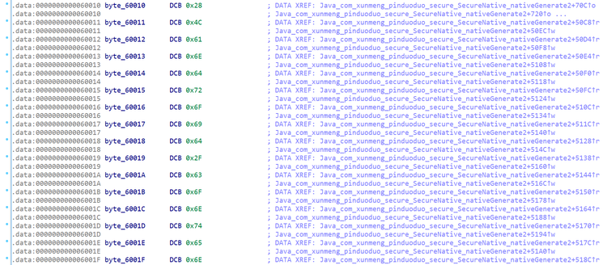
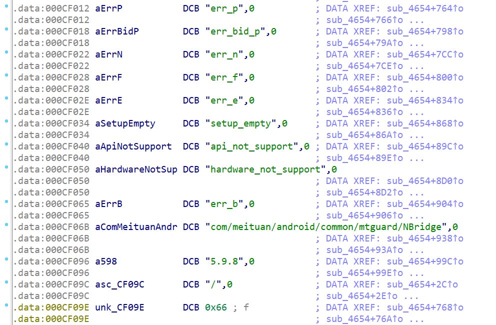

### dump回填

- 样本一(pdd)

  `byte_6225C ^= 0x5Eu;`也就是 `byte_6225C = byte_6225C ^ 0x5Eu;`。byte_address 在 IDA 中意值位于 address 位置的单个字节。因此表达式的语义就是将 0x6225C 地址处的字节和 0x5E 异或后，结果放回原处

  ```c
  byte_6225C ^= 0x5Eu;
  byte_6225D ^= 0x69u;
  byte_6225E ^= 0x5Fu;
  byte_6225F ^= 0xA9u;
  byte_62260 ^= 0x21u;
  byte_62261 ^= 0xA3u;
  byte_62262 ^= 0x8Cu;
  byte_62263 ^= 0x8Bu;
  byte_62264 ^= 0xE4u;
  byte_62265 ^= 5u;
  byte_62266 ^= 0x78u;
  byte_62267 ^= 0x23u;
  ```

  ```powershell
  import idaapi
  
  chr(idaapi.get_byte(0x6225c) ^ 0x5e)
  Out[7]: 'r'
  
  chr(idaapi.get_byte(0x6225d) ^ 0x69)
  Out[8]: 'o'
  
  chr(idaapi.get_byte(0x6225e) ^ 0x5f)
  Out[9]: '.'
  
  chr(idaapi.get_byte(0x6225f) ^ 0xa9)
  Out[10]: 'b'
  
  chr(idaapi.get_byte(0x62260) ^ 0x21)
  Out[11]: 'u'
  
  chr(idaapi.get_byte(0x62261) ^ 0xa3)
  Out[12]: 'i'
  
  chr(idaapi.get_byte(0x62262) ^ 0x8c)
  Out[13]: 'l'
  
  chr(idaapi.get_byte(0x62263) ^ 0x8b)
  Out[14]: 'd'
  
  chr(idaapi.get_byte(0x62264) ^ 0xe4)
  Out[15]: '.'
  
  chr(idaapi.get_byte(0x62265) ^ 0x05)
  Out[16]: 'i'
  
  chr(idaapi.get_byte(0x62266) ^ 0x78)
  Out[17]: 'd'
  
  chr(idaapi.get_byte(0x62267) ^ 0x23)
  Out[18]: '\x00'
  ```

   IDC 的体验也很好，展示如下

  ```powershell
  IDC>Byte(0x6225C) ^ 0x5e
          114.       72h         162o 0000000000000000000000000000000000000000000000000000000001110010b 'r.......'
  
  IDC>Byte(0x6225D) ^ 0x69
          111.       6Fh         157o 0000000000000000000000000000000000000000000000000000000001101111b 'o.......'
  ```

  此处密文在解密后，明文放到了原先密文的地址上，这种解密方式叫 **原地解密** 或 **覆盖解密**。这意味着我们可以**通过 patch 实现解密的功能。**

  ```powershell
  from idaapi import patch_byte, get_byte
  
  patch_byte(0x6225c, get_byte(0x6225c) ^ 0x5e)
  Out[3]: True
  
  patch_byte(0x6225d, get_byte(0x6225d) ^ 0x69)
  Out[4]: True
  
  patch_byte(0x6225e, get_byte(0x6225e) ^ 0x5f)
  Out[5]: True
  
  patch_byte(0x6225f, get_byte(0x6225f) ^ 0xa9)
  Out[6]: True
  
  patch_byte(0x62260, get_byte(0x62260) ^ 0x21)
  Out[7]: True
  
  patch_byte(0x62261, get_byte(0x62261) ^ 0xa3)
  Out[8]: True
  
  patch_byte(0x62262, get_byte(0x62262) ^ 0x8c)
  Out[9]: True
  
  patch_byte(0x62263, get_byte(0x62263) ^ 0x8b)
  Out[10]: True
  
  patch_byte(0x62264, get_byte(0x62264) ^ 0xe4)
  Out[11]: True
  
  patch_byte(0x62265, get_byte(0x62265) ^ 0x5)
  Out[12]: True
  
  patch_byte(0x62266, get_byte(0x62266) ^ 0x78)
  Out[13]: True
  
  patch_byte(0x62267, get_byte(0x62267) ^ 0x23)
  Out[14]: True
  ```

  patch 已经生效，转到 IDA 的 Hex 界面，它会将我们修改过的字节标为橘色，看起来十分直观。

  

  再回到反汇编界面，我们需要帮助 IDA 识别这个字符串

  

  鼠标悬停在首字节 byte_6225c 上，选择 Edit 菜单栏，Strings - String 确认转化为字符串，也可以直接使用快捷键 A 。

  

  对 sub_2D9B4 重新F5。

  

  IDA 对字符串的自动命名，默认情况下，IDA 会以 a 为前缀，根据字符串的内容，基于驼峰命名法做命名，比如上面的`aRoBuildId`。我们也可以介入与改变命名方式，使其更符合我们个人的习惯。首先打开 Options 菜单栏，General - Strings 设置面板，红框内部是可做的修改，修改会从下一次命名字符串开始生效。

  

  Prefix 用于设置前缀，默认为 a 。比如修改为 str_ 时，效果如下

  ```powershell
  .data:0000000000060030 str_AndroidPerm DCB "android.permission.READ_PHONE_STATE",0
  ```

  Preserver case 勾选框指是否使用驼峰命名法，否则会使用全小写命名，和上一条联合设置的效果如下

  ```powershell
  .data:0000000000060030 str_androidperm DCB "android.permission.READ_PHONE_STATE",0
  ```

  Generate serial names 意指不必根据字符串内容做命名，而是按照命名生成的先后，从数字 Number 开始命名，Width 为字符宽度。当 Number 设置为 100，Width 设置为 8 时，效果如下

  ```powershell
  .data:0000000000060084 str_00000100    DCB "rom_status=%ld",0  
  .data:0000000000060084                                         
  .data:0000000000060093                 ALIGN 4
  .data:0000000000060094 str_00000101    DCB "hitSpng",0         
  .data:0000000000060094                                      
  .data:000000000006009C str_00000102    DCB "pdd_config",0 
  ```

  在 sub_2D9B4 单个函数上，我们已经实现了初步的字符串反混淆。说这是一个初步的反混淆，是因为并没有将代码完全还原回字符串加密前的状态，字符串加密部分的逻辑应该被 patch 掉，反汇编或反编译里都不应该出现，但目前似乎已经够用，所以不做这种讨论，如何对全体函数做解密。 

  既然是覆盖解密。那么如果我们 dump 运行时的内存，如果目标函数已经执行过，那么它所对应的密文不就已经被明文覆盖了吗？比如从 0x609f0 开始的 16 字节，试试我们的 Frida 插件。

  ```c
  // 由ShowFridaCode生成的dump memory
  function dump_0x609f0() {
      var base_addr = Module.findBaseAddress("libpdd_secure.so");
      var dump_addr = base_addr.add(0x609f0);
      console.log(hexdump(dump_addr, {length: 0x10}));
  }
  ```

  Hook 结果如下，发现确实如此。

  ```powershell
  [MIX 2S::xxx]-> dump_0x609f0()
               0  1  2  3  4  5  6  7  8  9  A  B  C  D  E  F  0123456789ABCDEF
  73b40329f0  70 64 64 5f 73 65 63 75 72 65 5f 6e 61 74 69 76  pdd_secure_nativ
  [MIX 2S::xxx]->
  ```

  **只要目标函数已经被执行，那么其中的字符串就会被解密，进而可以 dump 到对应的明文字符串。因此我们需要运行一段时间 App，确保 SO 中的函数尽可能多的被执行，尽可能多的密文被解密为明文。或者反过来说，如果不这么做，比如刚启动 App 就 dump，甚至在 JNI_OnLoad 执行前就 dump，那么打印出来的依然是密文字符串。**

  那么问题的关键就在于——全体密文的具体位置在哪儿？逐一收集每个函数中所涉及到的解密地址范围是可行的，但比较麻烦。有没有比较简单粗糙，但可行的办法？

  让我们整体观察密文的存储位置，首先看一下各段的信息，View 菜单栏 - Open subviews - Segments。

  rodata 段，即只读数据段，它用于保存程序里面的常量数据。下图可见，其中的字符串都是可见明文。这很合理，常量加密的话，按照本样本的解密逻辑，没法覆盖写入。

  

  data 段，即可读写数据段，用于存放各种已初始化的变量。下图可见，其中找不到什么明文字符串数据。

  

  data 段中，字符串数据占据了较大一部分。因此，能不能省事一点，不去找所有密文所处的具体位置， dump 整个 data  段并回填呢？这么做可能会造成误伤，因为除了字符串以外的数据本不需要 dump，而且其中一些在运行时发生了改变， dump 放到静态文件中还会带来错误。但先不管这么多，我们目前最需要的是找个方法，它可以整体上解决问题，至于细节、优化、副作用可以放后面考虑。

  IDA View - Open subviews - Segments 查看 data 段的范围 0x60000 - 0x642E0，修改 Frida 脚本

  ```python
  function dump_memory() {
      var base_addr = Module.findBaseAddress("libpdd_secure.so");
      var dump_addr = base_addr.add(0x60000);
      console.log(hexdump(dump_addr, {length: 0x42E0}));
  }
  ```

  以 attach 模式附加到已启动的 App 上，运行尽可能多的代码逻辑，调用 dump_memory 函数，将 hexdump 获得的数据整体拷贝到 cyberchef 中查看。

  

  可以看到非常多的明文字符串。接下来将数据 tohex ，设置去除间隔符拷贝下来。

  

  使用IDA的 `patch_bytes` API做回填

  ```python
  import idaapi
  
  hex_string = "00000000000000000000000000000000284c616e64726f69642f636f6e74656e742f436f6e74657...."
  barr = bytes.fromhex(hex_string)
  idaapi.patch_bytes(0x60000, barr)
  ```

  查看 data 段的 Hex View

  

  确实覆盖了大部分内容，出现了不少明文。大家应该还记得，在前面解密和 Patch 单个函数时，我们手动转化和识别了字符串。但现在我们一次性处理了这么多明文，逐个识别实在太麻烦了，需要更好的办法。我们需要 IDA 做重新分析，或至少对 data 段做重新分析，使其自动识别这些字符串。

  **在 IDA 中如何做大范围的重新分析**？可以在 Options 菜单栏选择 General - Analyse 界面，点击 Reanalyse program 并确定，也可以在 IDA 左下角 状态栏右键，同样选择 Reanalyse program 。

  

  **但只通过 “重新分析”没法让 IDA 识别出字符串。猜测是因为 IDA 重新分析后，认为 byte 类型就挺对。**

  

  **假如我们选中 0x60010 - 0x6002C，右键 undefined 或用快捷键 U，使其回归未定位的状态，或者严谨一些说，“取消 IDA 对它的数据类型判断”。**

  然后再 Reanalyse program ，发现正常识别出了字符串

  ```powershell
  .data:0000000000060010 aLandroidConten_3 DCB "(Landroid/content/Context;)Z",0
  ```

  因此如果能将 data 段转化为尚未被分析的状态，再结合重新分析，就可以识别出大片字符串。**`del_items` 就是这样的 API，可以将从 startAddress 到 endAddress 范围内的数据和指令都转化为尚未分析的状态。参数 2 默认为 0 ，不用深究。**

  ```python
  ida_bytes.del_items(startAddress, 0, endAddress)
  ```

  Reanalyse program 也可以用 API 实现，而且可以指定范围。

  ```python
  ida_auto.plan_and_wait(startAddress, endAddress)
  ```

  结合在一起，我们可以对整个 data 段进行重新分析

  ```python
  import ida_auto
  import ida_bytes
  import idautils
  
  for i in idautils.Segments():
      seg = idaapi.getseg(i)
      segName = idaapi.get_segm_name(seg)
      if "data" in segName:
          startAddress = seg.start_ea
          endAddress = seg.end_ea
          ida_bytes.del_items(startAddress, 0, endAddress)
          ida_auto.plan_and_wait(startAddress, endAddress)
  ```

  运行结果如下，字符串全部被良好识别。

  

  需要注意，让 IDA 彻底重新分析的办法不止这一种，另一个方便的办法是将 IDA 中所作的 patch 保存回原文件，然后重新打开。操作如下，Edit - Patch program - Apply patches to input file，选择保存回原文件。然后重新打开 ，数据已经被良好呈现出来了。

  

  关于这一小节所阐述的 dump 法，**需要理解三点。**

  首先，我们发现一些字符串未被解密，这可能因为 SO 中的各种函数没有被充分运行，存在于函数内部的字符串尚未经过解密操作，dump 下来的依然是密文状态，前文已说过这一点。**让 App 充分运行后再 dump，依然可能部分密文未解密，因此某些逻辑可能一般操作真执行不到，动态分析就一定存在代码覆盖率的问题，很难避免**。

  其次，在上文我们也说过，data 中除了加密字符串以外的数据会被误伤，甚至被篡改成运行时错误的值，这个问题有时候会很严重和糟糕，比如像下面这样，但在我们这个样例里，似乎影响不算特别大。

  

  最后，dump 与回填不一定要依赖 IDA 和 Frida 。dump 也可以使用 ADB 的 dd 命令、IDA 的动态调试、GG 修改器、GDB/LLDB 等等。但如果不存在 Anti Frida，那么 Frida dump 就是最方便的选择。回填使用 IDA 脚本更不是唯一选择，只需要使得 dump 下来的内容覆盖原先 data 段的物理地址范围就行。需要注意区分物理偏移和虚拟地址，IDA 解析和展示 SO 时，采用虚拟地址（address），而处理静态文件时，需要基于实际偏移 offset 。以 data segment 的起始地址为例，其虚拟地址和实际物理偏移并不一定相同。IDA 中 patch 遵照其虚拟地址即可，因为 IDA 会替我们处理，映射到合适的物理地址上，而将 SO 作为二进制文件 patch 时，需要用实际物理地址。可以使用 readelf 查看详细的节信息。

  ```powershell
  C:\Users\13352>readelf -S "C:FileStorage\File\libpdd_secure.so"
  There are 25 section headers, starting at offset 0x63420:
  
  Section Headers:
    [Nr] Name              Type             Address           Offset
         Size              EntSize          Flags  Link  Info  Align
    [ 0]                   NULL             0000000000000000  00000000
         0000000000000000  0000000000000000           0     0     0
    [ 1] .note.gnu.bu[...] NOTE             0000000000000200  00000200
         0000000000000024  0000000000000000   A       0     0     4
    [ 2] .hash             HASH             0000000000000228  00000228
         000000000000029c  0000000000000004   A       4     0     8
    [ 3] .gnu.hash         GNU_HASH         00000000000004c8  000004c8
         00000000000000f8  0000000000000000   A       4     0     8
    [ 4] .dynsym           DYNSYM           00000000000005c0  000005c0
         0000000000000930  0000000000000018   A       5     3     8
    [ 5] .dynstr           STRTAB           0000000000000ef0  00000ef0
         0000000000000879  0000000000000000   A       0     0     1
    [ 6] .gnu.version      VERSYM           000000000000176a  0000176a
         00000000000000c4  0000000000000002   A       4     0     2
    [ 7] .gnu.version_r    VERNEED          0000000000001830  00001830
         0000000000000040  0000000000000000   A       5     2     8
    [ 8] .rela.dyn         RELA             0000000000001870  00001870
         00000000000006c0  0000000000000018   A       4     0     8
    [ 9] .rela.plt         RELA             0000000000001f30  00001f30
         00000000000005a0  0000000000000018  AI       4    20     8
    [10] .plt              PROGBITS         00000000000024d0  000024d0
         00000000000003e0  0000000000000010  AX       0     0     16
    [11] .text             PROGBITS         00000000000028b0  000028b0
         0000000000058ea4  0000000000000000  AX       0     0     4
    [12] .rodata           PROGBITS         000000000005b760  0005b760
         0000000000000874  0000000000000000   A       0     0     16
    [13] .eh_frame_hdr     PROGBITS         000000000005bfd4  0005bfd4
         000000000000061c  0000000000000000   A       0     0     4
    [14] .eh_frame         PROGBITS         000000000005c5f0  0005c5f0
         0000000000002110  0000000000000000   A       0     0     8
    [15] .note.androi[...] NOTE             000000000005e700  0005e700
         0000000000000098  0000000000000000   A       0     0     4
    [16] .init_array       INIT_ARRAY       000000000005fa70  0005ea70
         00000000000000b0  0000000000000008  WA       0     0     8
    [17] .fini_array       FINI_ARRAY       000000000005fb20  0005eb20
         0000000000000010  0000000000000008  WA       0     0     8
    [18] .data.rel.ro      PROGBITS         000000000005fb30  0005eb30
         00000000000000a0  0000000000000000  WA       0     0     8
    [19] .dynamic          DYNAMIC          000000000005fbd0  0005ebd0
         0000000000000220  0000000000000010  WA       5     0     8
    [20] .got              PROGBITS         000000000005fdf0  0005edf0
         0000000000000210  0000000000000008  WA       0     0     8
    [21] .data             PROGBITS         0000000000060000  0005f000
         00000000000042e0  0000000000000000  WA       0     0     16
    [22] .bss              NOBITS           00000000000642e0  000632e0
         0000000000008450  0000000000000000  WA       0     0     16
    [23] .comment          PROGBITS         0000000000000000  000632e0
         0000000000000054  0000000000000001  MS       0     0     1
    [24] .shstrtab         STRTAB           0000000000000000  00063334
         00000000000000e9  0000000000000000           0     0     1
  ```

  data 段的 address 是 0x60000，offset 是 0x5f000。可以使用 010Editor 之类的十六进制查看工具验证，文件中 从 0x5f000 开始的地址与 IDA 中从 0x60000 开始的数据一致。为了避免此类麻烦，我选择用 IDA 直接 patch。

- 样本二(zuiyou)

  打开 net_crypto ，有了之前的经验，我们直接来到 data 段

  

  IDA 的自动注释显示，这些字符都被 decodexxx 函数引用，交叉引用跳过去看看。

  

  我们看到十数个解密函数，可以发现，它也是原地解密，因此也可以 dump 回填。除此之外，decode 函数都位于 init_array 中。

  

  只要在 init_array 运行结束后的任意时机做 dump，字符串全部出于解密状态。这显然比上一个样本更好处理，不用担心代码覆盖率的问题，感兴趣的朋友可以拿它做 dump 回填的训练。

### Hook回填

- 样本一(mt)

  查看被引用数最多的函数

  ```python
  import idautils
  from operator import itemgetter
  import idc
  
  functionList = []
  for func in idautils.Functions():
      xrefs = idautils.CodeRefsTo(func, 0)
      xrefCount = len(list(xrefs))
      oneFuncDict = {"funcName":idc.get_func_name(func), "Address": hex(func), "xrefCount": xrefCount}
      functionList.append(oneFuncDict)
  
  function_list_by_countNum = sorted(functionList, key=itemgetter('xrefCount'),reverse=True)
  for func in function_list_by_countNum[:10]:
      print(func)
  ```

  在最高频被引用的函数中，分析到了 SO 的字符串解密函数。

  参数 1 用于存放解密后的字符串，参数 2 是密文字符串，参数 3 是 Key ，参数 4 是字符串长度。解密逻辑是简单的和 Key 做异或，key 每次运算后自增 3 。

  ```python
  _BYTE *__fastcall sub_5124(_BYTE *result, _BYTE *a2, int a3, int a4)
  {
    if ( a4 >= 1 )
    {
      do
      {
        *result = *a2 ^ a3;
        --a4;
        ++result;
        ++a2;
        a3 += 3;
      }
      while ( a4 );
    }
    return result;
  }
  ```

  查看一个此函数引用，byte_D7A6A的秘文解密后放入byte_D7735。

  ```c
  sub_5124(byte_D7735, byte_D7A6A, 19, 3);
  ```

  参数 1 用于存放解密后的字符串，参数 2 是密文字符串，可以发现，解密并非原地解密，而是置于 SO 中另一块区域。将解密后的明文 patch 覆盖参数 1 指向的解密后字符串

  首先修改 hook_sub_5124 函数，我们需要其打印如下内容备用

  - 参数1，即解密字符串的存放地址
  - 调用地址
  - 解密字符串长度

  ```js
  function hook_sub_5124(){
      var index = 0
      var base_addr = Module.findBaseAddress("libmtguard.so");
      console.log("enter")
      Interceptor.attach(base_addr.add(0x5125), {
          onEnter(args) {
              index += 1;
              this.buffer = args[0];
              this.length = args[3];
              // 打印函数调用地址
              this.LR = this.context.lr - base_addr - 5;
          },
          onLeave() {
              var decryptAddress = this.buffer - base_addr;
              console.log("index:"+ index + " $&$ decryptAddress:" + decryptAddress.toString(16) + " $&$ length:" +
                  this.length + " $&$ decryptStr:"+toHex(this.buffer.readCString()) + " $&$ callAddress:"+this.LR.toString(16))
          }
      });
  }
  
  function toHex(str) {
      var result = '';
      for (var i=0; i<str.length; i++) {
          result += str.charCodeAt(i).toString(16);
      }
      return result;
  }
  ```

  ```powershell
  index:1044 $&$ decryptAddress:d9273 $&$ length:0x5 $&$ decryptStr:253032783a $&$ callAddress:6c264
  ```

  把解密后的字符串放入到decryptAddress中。

  需要注意，有一些命令行工具打印输出时，输出太长会换行，这需要避免，否则后续解析会出错。除此之外，明文字符串在打印时，采用了十六进制格式，因为担心部分字符串乱码影响解析，也是防止分隔符和字符串的内容产生混淆。将 Hook 打印的全部条目拷贝到文件中，下面进入IDA 处理。

  ```
  import idaapi
  
  # 全路径，否则担心IDA找不到
  with open(r"C:\xxx\backup.txt", "r")as F:
      infos = F.readlines()
  
  for info in infos:
      try:
          info = info.strip().split(",")
          decryptAddress = int(info[1].split(":")[1],16)
          decryptInfo = bytes.fromhex(info[3].split(":")[1])
          idaapi.patch_bytes(decryptAddress, decryptInfo)
      except:
          print("parse error")
  ```

  ```python
  # python2
  import idaapi
  import binascii
  
  with open(r"/Users/xxxx/Downloads/backup.txt", "r")as F:
      infos = F.readlines()
  
  for info in infos:
      try:
          info = info.strip().split(",")
          decryptAddress = int(info[1].split(":")[1],16)
          # decryptInfo = bytes.fromhex()
          decryptInfo = binascii.a2b_hex(info[3].split(":")[1])
          idaapi.patch_bytes(decryptAddress, decryptInfo)
      except Exception as e:
          print(e)
          print("parse error")
  ```

  运行后开始考虑字符串尚未识别的问题

  

  使用上文提到的重新分析 data 段的脚本

  

  可以发现确实很多字符串被识别出来了，但眼尖的读者可能会发现，依然有一部分没能正确识别为字符串。

  

  因为这个样本存在一定的花指令，干扰了反汇编，进而干扰了函数识别、交叉引用、反编译等高级分析过程，IDA 在重新分析时，依然没有办法自动识别出部分字符串。前面说过，我们可以框选出某个字符串区间，然后快捷键 A，手动转字符串。

  ```python
  .data:000CF182 aV5DeviceInfoCo DCB "v5_device_info_collect_time_first",0
  ```

  但显然一个个做太麻烦了，这种情况下可以使用`create_strlit`API，它用于将一个地址范围内的数据转为字符串，参数 3 为`idaapi.STRTYPE_TERMCHR` 时，意味着生成 C 风格的字符串（以 \0 结尾）。

  ```python
  idaapi.create_strlit(address, length, flag)
  ```

  别忘了我们所收集的信息里包括解密的长度 。

  ```python
  import idaapi
  
  # 全路径，否则担心IDA找不到
  with open(r"C:\xxx\backup.txt", "r")as F:
      infos = F.readlines()
  
  for info in infos:
      try:
          info = info.strip().split(",")
          decryptAddress = int(info[1].split(":")[1],16)
          decryptInfo = bytes.fromhex(info[3].split(":")[1])
          length = int(info[2].split(":")[1],16)
          idaapi.patch_bytes(decryptAddress, decryptInfo)
          idaapi.create_strlit(decryptAddress, length, idaapi.STRTYPE_TERMCHR)
      except:
          print("parse error")
  ```

  运行脚本，完全符合我们预期。

  下面讨论一个问题，是不是只能用回填来处理字符串解混淆？比如通过注释。IDA 提供多形式的注释可供选择。首先是汇编界面的注释。

  - 重复注释
  - 常规注释

  

  常规注释在注释后只会出现在当前汇编行的尾部，重复注释会在当前行尾部以及所有引用当前行的地方出现注释。我们做解密字符串的标注，用重复模式更清晰醒目。

  IDAPython 中对应 API 为 `idaapi.set_cmt(ea, commentStr, flag)`，参数 1 是地址，参数 2 是注释文本，参数 3 为 flag，1 表示重复注释， 0 表示常规注释。稍微修改一下回填脚本，测试效果。

  ```python
  import idaapi
  
  # 全路径，否则担心IDA找不到
  with open(r"C:\xxx\backup.txt", "r")as F:
      infos = F.readlines()
  
  for info in infos:
      try:
          info = info.strip().split(",")
          decryptAddress = int(info[1].split(":")[1],16)
          decryptInfo = bytes.fromhex(info[3].split(":")[1])
          idaapi.set_cmt(decryptAddress, decryptInfo.decode("UTF-8"), 1)
      except:
          print("parse error")
  ```

  如下图所示，在密文右侧出现了对应的明文注释

  

  数据使用处也可以看到对应注释

  

  但从效果上说，汇编注释不如回填数据“好看”。关于注释，还有一个好玩的项目 [showcomments](https://github.com/merces/showcomments)，它可以方便的管理和查看所有的注释。

- 样本二(aweme)

  打开 libmetasec_ml.so，找几个函数看看 ，我选择 sub_910C。

  ```c
  int sub_910C()
  {
      int v0; // r0
      int v1; // r0
      int v2; // r0
      int v3; // r0
      int v4; // r0
      int v5; // r0
      _DWORD *v6; // r0
      int v7; // r0
      int result; // r0
      
      sub_7DF68((int)&unk_B3DA0, (char *)&unk_99AF0);
      _cxa_atexit((void (__fastcall *)(void *))sub_7E06C, &unk_B3DA0, &off_B3000);
      if ( !dword_B3D90 )
      {
          v0 = operator new[](3u);
          *(_WORD *)v0 = 31575;
          *(_BYTE *)(v0 + 2) = 127;
          sub_77C04();
          if ( !dword_B3D90 )
              dword_B3D90 = v1;
      }
      dword_B3D80 = dword_B3D90;
      if ( !dword_B3D94 )
      {
          v2 = operator new[](0xAu);
          *(_DWORD *)v2 = -381345581;
          *(_DWORD *)(v2 + 4) = -2117098656;
          *(_WORD *)(v2 + 8) = 4252;
          sub_7715C();
          if ( !dword_B3D94 )
              dword_B3D94 = v3;
      }
      dword_B3D84 = dword_B3D94;
      if ( !dword_B3D98 )
      {
          v4 = operator new[](0x12u);
          *(_DWORD *)v4 = -105569581;
          *(_DWORD *)(v4 + 4) = -2107694256;
          *(_DWORD *)(v4 + 8) = -1142931556;
          *(_DWORD *)(v4 + 12) = -1676642288;
          *(_WORD *)(v4 + 16) = 4756;
          sub_7727C();
          if ( !dword_B3D98 )
              dword_B3D98 = v5;
      }
      dword_B3D88 = dword_B3D98;
      if ( !dword_B3D9C )
      {
          v6 = (_DWORD *)operator new[](4u);
          *v6 = -408875388;
          v7 = sub_77698(v6, 4);
          if ( !dword_B3D9C )
              dword_B3D9C = v7;
      }
      result = dword_B3D9C;
      dword_B3D8C = dword_B3D9C;
      return result;
  }
  ```

  其中有四段是字符串以及其解密操作

  ```c
  // part1
  v0 = operator new[](3u);
  *(_WORD *)v0 = 31575;
  *(_BYTE *)(v0 + 2) = 127;
  sub_77C04();
  
  // part2
  v2 = operator new[](0xAu);
  *(_DWORD *)v2 = -381345581;
  *(_DWORD *)(v2 + 4) = -2117098656;
  *(_WORD *)(v2 + 8) = 4252;
  sub_7715C();
  
  // part3
  v4 = operator new[](0x12u);
  *(_DWORD *)v4 = -105569581;
  *(_DWORD *)(v4 + 4) = -2107694256;
  *(_DWORD *)(v4 + 8) = -1142931556;
  *(_DWORD *)(v4 + 12) = -1676642288;
  *(_WORD *)(v4 + 16) = 4756;
  sub_7727C();
  
  // part4
  v6 = (_DWORD *)operator new[](4u);
  *v6 = -408875388;
  v7 = sub_77698(v6, 4);
  ```

  这所谓的字符串解密，似乎和前面的都不太一样。sub_7727C 等四个解密函数的参数和返回值没有正确识别，这一定程度影响了大家的理解。读者换个 IDA 版本试一下，或者用 Ghidra 就可以看到比较好的反编译效果，比如下面是 Ghidra 对该函数的反编译效果。（需要注意，Ghidra 在 ARM32 中默认基地址 0x10000，ARM64 中默认基地址 0x100000，因此如下 FUN_00087c04 就是 IDA 中 _77C04。）

  ```
  {
    undefined2 *puVar1;
    int iVar2;
    undefined4 *puVar3;
    
    FUN_0008df68(&DAT_000c3da0,&DAT_000a9af0);
    __cxa_atexit(FUN_0008e06c + 1,&DAT_000c3da0,&DAT_000c3000);
    if (DAT_000c3d90 == 0) {
      puVar1 = (undefined2 *)operator.new[](3);
      *puVar1 = 0x7b57;
      *(undefined *)(puVar1 + 1) = 0x7f;
      iVar2 = FUN_00087c04(puVar1,3);
      if (DAT_000c3d90 == 0) {
        DAT_000c3d90 = iVar2;
      }
    }
    DAT_000c3d80 = DAT_000c3d90;
    if (DAT_000c3d94 == 0) {
      puVar3 = (undefined4 *)operator.new[](10);
      *puVar3 = 0xe94520d3;
      puVar3[1] = 0x81cfa360;
      *(undefined2 *)(puVar3 + 2) = 0x109c;
      iVar2 = FUN_0008715c(puVar3,10);
      if (DAT_000c3d94 == 0) {
        DAT_000c3d94 = iVar2;
      }
    }
    DAT_000c3d84 = DAT_000c3d94;
    if (DAT_000c3d98 == 0) {
      puVar3 = (undefined4 *)operator.new[](0x12);
      *puVar3 = 0xf9b522d3;
      puVar3[1] = 0x825f2350;
      puVar3[2] = 0xbbe03f9c;
      puVar3[3] = 0x9c107810;
      *(undefined2 *)(puVar3 + 4) = 0x1294;
      iVar2 = FUN_0008727c(puVar3,0x12);
      if (DAT_000c3d98 == 0) {
        DAT_000c3d98 = iVar2;
      }
    }
    DAT_000c3d88 = DAT_000c3d98;
    if (DAT_000c3d9c == 0) {
      puVar3 = (undefined4 *)operator.new[](4);
      *puVar3 = 0xe7a10e84;
      iVar2 = FUN_00087698(puVar3,4);
      if (DAT_000c3d9c == 0) {
        DAT_000c3d9c = iVar2;
      }
    }
    DAT_000c3d8c = DAT_000c3d9c;
    return;
  }
  ```

  我们拿 part3 举例

  ```c
  // IDA
  if ( !dword_B3D98 )
  {
      v4 = operator new[](0x12u);
      *(_DWORD *)v4 = -105569581;
      *(_DWORD *)(v4 + 4) = -2107694256;
      *(_DWORD *)(v4 + 8) = -1142931556;
      *(_DWORD *)(v4 + 12) = -1676642288;
      *(_WORD *)(v4 + 16) = 4756;
      sub_7727C();
      if ( !dword_B3D98 )
          dword_B3D98 = v5;
  }
  
  // Ghidra 
  if (DAT_000c3d98 == 0) {
      puVar3 = (undefined4 *)operator.new[](0x12);
      *puVar3 = 0xf9b522d3;
      puVar3[1] = 0x825f2350;
      puVar3[2] = 0xbbe03f9c;
      puVar3[3] = 0x9c107810;
      *(undefined2 *)(puVar3 + 4) = 0x1294;
      iVar2 = FUN_0008727c(puVar3,0x12);
      if (DAT_000c3d98 == 0) {
          DAT_000c3d98 = iVar2;
      }
  }
  ```

  sub_7727C 应该有两个参数，可以根据 Ghidra 的结果对 IDA 的函数定义做修正

  

  

  四个解密函数都这么做后，看起来好多了

  ```c
  int sub_910C()
  {
    int v0; // r0
    int v1; // r0
    int v2; // r0
    int v3; // r0
    int v4; // r0
    int v5; // r0
    _DWORD *v6; // r0
    int v7; // r0
    int result; // r0
  
    sub_7DF68((int)&unk_B3DA0, (char *)&unk_99AF0);
    _cxa_atexit((void (__fastcall *)(void *))sub_7E06C, &unk_B3DA0, &off_B3000);
    if ( !dword_B3D90 )
    {
      v0 = operator new[](3u);
      *(_WORD *)v0 = 31575;
      *(_BYTE *)(v0 + 2) = 127;
      v1 = sub_77C04(v0, 3);
      if ( !dword_B3D90 )
        dword_B3D90 = v1;
    }
    dword_B3D80 = dword_B3D90;
    if ( !dword_B3D94 )
    {
      v2 = operator new[](0xAu);
      *(_DWORD *)v2 = -381345581;
      *(_DWORD *)(v2 + 4) = -2117098656;
      *(_WORD *)(v2 + 8) = 4252;
      v3 = sub_7715C(v2, 10);
      if ( !dword_B3D94 )
        dword_B3D94 = v3;
    }
    dword_B3D84 = dword_B3D94;
    if ( !dword_B3D98 )
    {
      v4 = operator new[](0x12u);
      *(_DWORD *)v4 = -105569581;
      *(_DWORD *)(v4 + 4) = -2107694256;
      *(_DWORD *)(v4 + 8) = -1142931556;
      *(_DWORD *)(v4 + 12) = -1676642288;
      *(_WORD *)(v4 + 16) = 4756;
      v5 = sub_7727C(v4, 18);
      if ( !dword_B3D98 )
        dword_B3D98 = v5;
    }
    dword_B3D88 = dword_B3D98;
    if ( !dword_B3D9C )
    {
      v6 = (_DWORD *)operator new[](4u);
      *v6 = -408875388;
      sub_77698((int)v6, 4);
      if ( !dword_B3D9C )
        dword_B3D9C = v7;
    }
    result = dword_B3D9C;
    dword_B3D8C = dword_B3D9C;
    return result;
  }
  ```

  解密函数的参数 1 是指向密文字符串的指针，参数 2 是长度。首先，我们前面接触的几个样例中，字符串密文存放在 SO 的段上，而这个样本用 operator new[] 分配了堆内存用来存放密文。在这些糟糕的数字上按 H，转成十六进制，看起来会清晰很多。

  ```c
  v2 = operator new[](0xAu);
  *(_DWORD *)v2 = 0xE94520D3;
  *(_DWORD *)(v2 + 4) = 0x81CFA360;
  *(_WORD *)(v2 + 8) = 0x109C;
  v3 = sub_7715C(v2, 10);
  ```

  本质上就是存储了  D3 20 45 E9 60 A3 CF 81 9C 10 这十个字节，找第二个让我们晦涩的点——就是这儿的字符串解密函数，先前的例子只有一个字符串解密函数，这个样本至少有四个。不必对此感到忧虑，复杂的样本中，甚至可以让加密字符串和解密函数实现一对一，但这并不是什么大不了的事。

  第三个点是解密函数的具体逻辑，大家点进去解密函数，会感觉很复杂，不用管它看起来多复杂，对于我们 Hook 回填没影响，不管多复杂，真机能执行就行。

  第四个点，解密后的明文放在哪儿？解密函数看不太真切，Frida Hook 分析会发现，解密明文覆盖了密文。

  下面我们准备写 Hook 回填脚本，首先验证这四个解密函数，是否真是解密函数？

  ```js
  function hookInit(){
      var linkername;
      var alreadyHook = false;
      var call_constructor_addr = null;
      var arch = Process.arch;
      if (arch.endsWith("arm")) {
          linkername = "linker";
      } else {
          linkername = "linker64";
      }
      
      var symbols = Module.enumerateSymbolsSync(linkername);
      for (var i = 0; i < symbols.length; i++) {
          var symbol = symbols[i];
          if (symbol.name.indexOf("call_constructor") !== -1) {
              call_constructor_addr = symbol.address;
          }
      }
      
      if (call_constructor_addr.compare(NULL) > 0) {
          console.log("get construct address");
          Interceptor.attach(call_constructor_addr, {
              onEnter: function (args) {
                  if(alreadyHook === false){
                      const targetModule = Process.findModuleByName("libmetasec_ml.so");
                      if (targetModule !== null) {
                          alreadyHook = true;
                          inittodo();
                      }
                  }
              }
          });
      }
  }
  
  function inittodo(){
      hook_decrypt();
  }
  
  
  function hook_decrypt(){
      var base_addr = Module.findBaseAddress("libmetasec_ml.so");
      
      Interceptor.attach(base_addr.add(0x77c05), {
          onEnter(args) {
          },
          onLeave(retval) {
              console.log(retval.readCString());
          }
      });
      
      Interceptor.attach(base_addr.add(0x7715d), {
          onEnter(args) {
          },
          onLeave(retval) {
              console.log(retval.readCString());
          }
      });
      
      Interceptor.attach(base_addr.add(0x7727d), {
          onEnter(args) {
          },
          onLeave(retval) {
              console.log(retval.readCString());
          }
      });
      
      Interceptor.attach(base_addr.add(0x77699), {
          onEnter(args) {
          },
          onLeave(retval) {
              console.log(retval.readCString());
          }
      });
  }
  
  
  hookInit();
  ```

  运行发现，确实打印了大量的明文字符串，其中包括一些明显是环境检测的字符串

  ```powershell
  /data/data/yk.juejin
  /data/data/com.cyjh.mobileanjian
  /data/data/com.cyjh.mobileanjianen
  /data/data/com.touchsprite.android
  /data/data/net.aisence.Touchelper
  /data/data/com.touch.fairy
  /data/data/com.zdanjian.zdanjian
  /data/data/simplehat.clicker
  /system/xbin/su
  /system/bin/shuamesu
  /system/xbin/daemonsu
  /system/bin/bdsu
  /system/xbin/bdsu
  /system/bin/.su
  /system/xbin/ku.sud
  /system/xbin/bstk/su
  /system/bin/sudo
  /sbin/su
  /data/data/com.topjohnwu.magisk
  /system/app/longeneroot.apk
  /system/app/Supersupro/Supersupro.apk
  /data/data/com.kingroot.kinguser
  /data/data/com.meizu.mzroottools
  /data/data/com.devadvance.rootcloak2
  /data/data/com.qihoo.permmgr
  /data/data/com.baidu.easyroot
  /data/data/hh.root
  /data/data/com.shuame.rootgenius
  /data/data/com.mtk.user2root
  /sbin/magiskhide
  /sbin/magiskinit
  /sbin/.magisk
  ```

  但是 Hook 没过几秒钟 App 就会闪退，简单分析应该是有 Anti Frida。

  解密函数 sub_7715C 的具体逻辑

  ```c
  def fun_7715C(barr, length):
      result = ""
      key = [0xA5, 0x10, 0x71, 0xC7, 0x50, 0x90, 0xE1, 0xB1]
      for i in range(length):
          tmp = barr[i] ^ key[i & 7]
          result += chr(tmp)
      return result
  ```

  以下面这处调用为例

  ```c
  v12 = operator new[](0x17u);
  *(_DWORD *)v12 = 0xA61B5C8D;
  *(_DWORD *)(v12 + 4) = 0xDDCEF126;
  *(_DWORD *)(v12 + 8) = 0xE8167EC4;
  *(_DWORD *)(v12 + 12) = 0xD893E403;
  *(_WORD *)(v12 + 16) = 0x77CB;
  *(_DWORD *)(v12 + 18) = 0xD20BEE4A;
  *(_BYTE *)(v12 + 22) = 0xE1;
  v13 = sub_7715C();
  ```

  ```python
  print(fun_7715C(b"\x8D\x5C\x1B\xA6\x26\xF1\xCE\xDD\xC4\x7E\x16\xE8\x03\xE4\x93\xD8\xCB\x77\x4A\xEE\x0B\xD2\xE1", 0x17))
  ```

  输出`(Ljava/lang/String;)[B`。

  解密函数 sub_77698 的具体逻辑

  ```c
  def fun_77698(barr, length):
      result = ""
      key = [0xb5, 0x20, 0x91, 0xe7, 0x40, 0xa0, 0xe3, 0xb6]
      for i in range(length):
          tmp = barr[i] ^ key[i & 7]
          result += chr(tmp)
      return result
  ```

  以下面这处调用为例，读者朋友们应该注意到，这里的反编译效果很差，数组被识别成数个变量。

  ```c
  v107 = 0xB3F544D4;
  v108 = 0xC58DC132;
  v109 = 0x93E34FC5;
  v110 = 0xD393D914;
  LOBYTE(v111) = 0xB5;
  sub_77698((int)&v107, 17);
  ```

  测试

  ```python
  print(fun_77698(b"\xD4\x44\xF5\xB3\x32\xC1\x8D\xC5\xC5\x4F\xE3\x93\x14\xD9\x93\xD3\xB5", 17))
  ```

  输出`addTransportType`。

- 样本3(树美)

  交叉引用排第四的这个函数看着像字符串解密函数。

  ```powershell
  {'funcName': '.__stack_chk_fail', 'Address': '0x7760', 'xrefCount': 104}
  {'funcName': '.free', 'Address': '0x7930', 'xrefCount': 102}
  {'funcName': '.memset', 'Address': '0x78f0', 'xrefCount': 91}
  {'funcName': 'sub_80D8', 'Address': '0x80d8', 'xrefCount': 77}
  {'funcName': '.strlen', 'Address': '0x7890', 'xrefCount': 66}
  {'funcName': 'sub_5D998', 'Address': '0x5d998', 'xrefCount': 65}
  {'funcName': '.memcpy', 'Address': '0x78e0', 'xrefCount': 57}
  {'funcName': 'sub_7FEC8', 'Address': '0x7fec8', 'xrefCount': 55}
  {'funcName': 'sub_4C488', 'Address': '0x4c488', 'xrefCount': 45}
  {'funcName': '.malloc', 'Address': '0x78d0', 'xrefCount': 36}
  ```

  调用处是这样

  ```c
  sub_80D8("UWRYubYl2XXvaG3S9r5ezWcxX/VsRigluNW58+nIYq4=", 44LL);
  ```

  介绍这个例子的原因在于，前面所展示的样本，字符串解密函数都是简单异或或变形的异或（dy 除外），读者不应该因此认为，字符串加解密总是使用简单算法。事实上，加解密可以采用任意一种可逆的古典或现代算法。我们看到很多字符串加解密使用异或，仅仅是因为异或简单好用以及最常用的几种字符串混淆方案使用异或。

  下面首先确认是否是解密算法， Frida Hook 测试一下

  ```js
  function hookInit(){
    var linkername;
    var alreadyHook = false;
    var call_constructor_addr = null;
    var arch = Process.arch;
    if (arch.endsWith("arm")) {
      linkername = "linker";
    } else {
      linkername = "linker64";
    }
    
    var symbols = Module.enumerateSymbolsSync(linkername);
    for (var i = 0; i < symbols.length; i++) {
      var symbol = symbols[i];
      if (symbol.name.indexOf("call_constructor") !== -1) {
        call_constructor_addr = symbol.address;
      }
    }
    
    if (call_constructor_addr.compare(NULL) > 0) {
      console.log("get construct address");
      Interceptor.attach(call_constructor_addr, {
        onEnter: function (args) {
          if(alreadyHook === false){
            const targetModule = Process.findModuleByName("libsmsdk.so");
            if (targetModule !== null) {
              alreadyHook = true;
              inittodo();
            }
          }
        }
      });
    }
  }
  
  function inittodo(){
    hook_sub_80D8();
  }
  
  
  function hook_sub_80D8(){
    var base_addr = Module.findBaseAddress("libsmsdk.so");
    
    Interceptor.attach(base_addr.add(0x80d8), {
      onEnter(args) {
        
      },
      onLeave(retval) {
        console.log(retval.readCString());
      }
    });
  }
  
  hookInit();
  ```

  ```shell
  ro.serialno
  ro.build.fingerprint
  /system/bin/su
  /system/xbin/su
  /proc/self/maps
  substrate
  XposedBridge.jar
  /system/bin/ls
  arm64-v8a
  [{"key":"maps2","type":"file","path":"file:///proc/self/maps","option":"regex","words":["/data/.+\\.so"]},{"key":"wlan0","type":"dir","path":"file:///sys/class/net/wlan0","option":"exists"},{"key":"eth0","typ
  e":"dir","path":"file:///sys/class/net/eth0","option":"exists"},{"key":"iomem","type":"file","path":"file:///proc/iomem","option":"match","words":["qemu-pipe","goldfish","vbox"]},{"key":"misc","type":"file","
  path":"file:///proc/misc","option":"match","words":["vbox","qemu"]},{"key":"hnf1","type":"file","path":"file:///sdcard/user","option":"exists"},{"key":"hnf2","type":"file","path":"file:///data/local/tmp/user"
  ,"option":"exists"},{"key":"hnf3","type":"file","path":"file:///sdcard/fenshen/device.zip","option":"exists"},{"key":"hnf4","type":"dir","path":"file:///data/local/tmp/configs","option":"exists"},{"key":"hnf5
  ","type":"file","path":"file:///sdcard/fenshen/xiansi.json","option":"exists"},{"key":"hnf6","type":"file","path":"file:///sdcard/fenshen/gps.json","option":"exists"},{"key":"hnf7","type":"file","path":"file:
  ///data/local/tmp/configs/.a","option":"exists"},{"key":"hnf8","type":"file","path":"file:///data/local/tmp/configs/.d","option":"exists"},{"key":"hnf9","type":"file","path":"file:///data/local/tmp/configs/.e
  n","option":"exists"},{"key":"hnf10","type":"file","path":"file:///data/local/tmp/configs/.gg","option":"exists"},{"key":"hnf11","type":"file","path":"file:///data/local/tmp/configs/.me","option":"exists"},{"
  key":"vgd1","type":"dir","path":"file:///sdcard/wgzs","option":"exists"},{"key":"vgd2","type":"dir","path":"file:///dev/wgzs","option":"exists"},{"key":"sbsf1","type":"file","path":"file:///proc/self/maps","o
  ption":"match","words":["/system/framework/ZpoosedBridge.jar"]},{"key":"sbsf2","type":"file","path":"file:///data/user_de/0/zpp.wjy.zposed.installer","option":"exists"},{"key":"sbsf3","type":"file","path":"fi
  le:///data/data/zpp.wjy.zposed.installer","option":"exists"}]
  ```

  我们确认它是字符串解密函数，其次，解密函数只调用几十次，相较于其他样本，这个数量非常少。但是，其他样本中，每次解密只解密一条明文，而这个样本的单次解密中，有时会解密大的字符串表。

  下面具体分析字符串解密算法，使用Unidbg做处理会很方便，下面是简单的架子，大家可以用星球先前教过的各种技巧与知识去分析这个算法。

  ```java
  package com.sm;
  
  import com.github.unidbg.AndroidEmulator;
  import com.github.unidbg.LibraryResolver;
  import com.github.unidbg.Module;
  import com.github.unidbg.linux.android.AndroidEmulatorBuilder;
  import com.github.unidbg.linux.android.AndroidResolver;
  import com.github.unidbg.linux.android.dvm.DalvikModule;
  import com.github.unidbg.linux.android.dvm.VM;
  import com.github.unidbg.memory.Memory;
  import com.github.unidbg.memory.MemoryBlock;
  import com.github.unidbg.pointer.UnidbgPointer;
  
  import java.io.File;
  import java.nio.charset.StandardCharsets;
  
  public class SM {
      private final AndroidEmulator emulator;
      private final VM vm;
      private final Module module;
      
      private SM(){
          emulator = AndroidEmulatorBuilder.for64Bit().build(); // 创建模拟器实例
          
          Memory memory = emulator.getMemory();
          
          // 设置sdk版本
          LibraryResolver resolver = new AndroidResolver(23);
          // 加载到内存中
          memory.setLibraryResolver(resolver);
          
          vm = emulator.createDalvikVM(new File("unidbg-android/src/test/resources/sm/bixin_8.7.3.apk"));
          // 是否打印日志
          vm.setVerbose(true);
          DalvikModule dm = vm.loadLibrary("smsdk", true);
          module = dm.getModule();
      }
      
      public static void main(String[] args) {
          SM sm = new SM();
          sm.callDecrypt();
      }
      
      public void callDecrypt(){
          int length = 44;
          MemoryBlock memoryBlock = emulator.getMemory().malloc(length + 1, true);
          memoryBlock.getPointer().write(0, "UWRYubYl2XXvaG3S9r5ezWcxX/VsRigluNW58+nIYq4=\0".getBytes(StandardCharsets.UTF_8), 0 , length+1);
          UnidbgPointer pointer = memoryBlock.getPointer();
          Number number = module.callFunction(emulator, 0x80d8, pointer.peer, length);
          UnidbgPointer ret = UnidbgPointer.pointer(emulator, number);
          // result:/proc/self/maps
          System.out.println("result:"+ret.getString(0));
      }
      
  }
  ```

  密文首先做 base64 解码，然后经过AES - 256 解密，模式为 CBC，IV 是固定的 0102030405060708 字符串，Key 是对字符串 "smsdkshumeiorganizationflag" MD5 后的结果。

