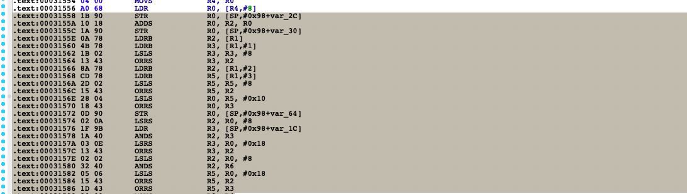

- 获取文件名

  ```powershell
  import idaapi
  idaapi.get_root_filename()
  Out[1]: 'libpdd_secure.so'
  
  # 也用用下面这个API
  import os
  os.path.basename(idaapi.get_input_file_path())
  Out[63]: 'libpdd_secure.so'
  ```

- 获取函数名

  ```powershell
  idaapi.get_func_name(0x3dd50)
  Out[2]: 'sub_3DD50'
  ```

- 获取参数个数和返回值, 需要使用 IDAPython 的反编译相关 API ，查看反编译所得伪代码。

  ```c
  # 比如下面这样的F5结果
  int __fastcall sub_3DD50(int a1, int a2, int a3)
  {
      void *v6; // r4
      
      v6 = malloc(0xB0u);
      sub_3A8F8(a1, v6, 10, 4);
      sub_3CC68(a2, a3, v6, 10);
      return sub_64F30(v6);
  }
  ```

  ```python
  cfun = idaapi.decompile(0x51578)
  ```

  对参数个数的查询

  ```python
  cfun.arguments
  Out[89]: 
  [<ida_hexrays.lvar_t; proxy of <Swig Object of type 'lvar_t *' at 0x0000021C95A62D50> >,
   <ida_hexrays.lvar_t; proxy of <Swig Object of type 'lvar_t *' at 0x0000021C95A62780> >,
   <ida_hexrays.lvar_t; proxy of <Swig Object of type 'lvar_t *' at 0x0000021C95A62420> >,
   <ida_hexrays.lvar_t; proxy of <Swig Object of type 'lvar_t *' at 0x0000021C95A62DB0> >]
  
  len(cfun.arguments)
  Out[90]: 4
  ```

  返回值是否是 void ？解析函数原型，根据是否以 void 开头来判断是否存在返回值，同时得避免误识别 void * 。**void * 表示返回任意类型的值的指针**。

  ```python
  dcl = cfun.print_dcl()
  print(dcl)
  int __fastcall sub_4C228	(	_DWORD *a1	,	 int a2	,	 int a3	,	 int a4	)	
  
  cfun.print_dcl()
  Out[99]: '\x01\x17int __fastcall sub_4C228\x01\t(\x02\t_DWORD *a1\x01\t,\x02\t int a2\x01\t,\x02\t int a3\x01\t,\x02\t int a4\x01\t)\x02\t\x02\x17'
  
  #但在 IPyIDA 中对这个 API 测试打印时，返回的内容中似乎穿插了一些奇怪的字节。不要觉得意外，应该将打印的反编译代码理解为一种富文本。通过 print_dcl API 打印出的函数原型，其中的奇怪字节就是颜色相关的信息。我们需要纯文本，可以通过 API 去除这些颜色信息。
  
  import ida_lines
  
  ida_lines.tag_remove(cfun.print_dcl())
  Out[103]: 'int __fastcall sub_4C228(_DWORD *a1, int a2, int a3, int a4)'
  ```

- 判断函数是否为首地址

  ```python
  FUNCATTR_START   =  0     # readonly: 函数起始地址
  FUNCATTR_END     =  4     # readonly: 函数结束地址
  FUNCATTR_FLAGS   =  8     # 函数的 flags
  FUNCATTR_FRAME   = 16     # readonly: function frame id
  FUNCATTR_FRSIZE  = 20     # readonly: 本地变量所占大小
  FUNCATTR_FRREGS  = 24     # readonly: 保存寄存器区域所占大小
  ```

  ```python
  hex(idc.get_func_attr(0x2288, 0))
  Out[111]: '0x2288'
  
  hex(idc.get_func_attr(0x110b0, 0))
  Out[112]: '0x110a8'
  ```

- 判断正在处理的文件是ARM32还是ARM64

  ```python
  import idaapi
  
  idaapi.get_inf_structure().is_64bit()
  Out[3]: False
  
  idaapi.get_inf_structure().is_32bit()
  Out[4]: True
  ```

- 判断是arm还是thumb, 静态分析中, 可以通过T标志位判断

  ```
  idc.get_sreg(addr, "T") thumb返回1，否则返回0
  ```

- View_Hooks

  ```python
  class View_Hooks:
      
      def view_activated(self, *args):
          # 界面打开
          pass
  
      def view_deactivated(self, *args):
          # 离开界面
          pass
      
      def view_keydown(self, *args):
          pass
      
      def view_click(self, *args):
          pass
      
      def view_dblclick(self, *args):
          pass
      
      # ... 省略
  ```

  当一个界面被展示在最前端时是 activated 状态，被其他界面覆盖不可见时是 deactivated 状态。如果刷新界面，其实是一个短暂的从可见到不可见再到可见的状态，即 deactivated + activated 。

  ```python
  import idaapi
  
  class Hook(idaapi.View_Hooks):
      def view_activated(self, view):
          viewName = idaapi.get_widget_title(view)
          print("view active:"+viewName)
  
      def view_deactivated(self, view):
          viewName = idaapi.get_widget_title(view)
          print("view deactive:"+viewName)
  
  myViewHook = Hook()
  # 开启自定义的View Hook
  myViewHook.hook()
  
  ```

  view_created 和 view_close 界面的创建与关闭

  ```python
  def view_created(self, view):
      viewName = idaapi.get_widget_title(view)
      # 我们可以对 viewName 字符串做正则匹配，进而判断当前界面是否是反汇编界面，诸如 viewName.contains("IDA View")
      # widgetType = idaapi.get_widget_type(view)
      # if widgetType == idaapi.BWN_DISASM:
      #    后续逻辑
      print("view create:"+viewName)
  
  def view_close(self, view):
      viewName = idaapi.get_widget_title(view)
      print("view close:"+viewName)
  ```

  view_keydown 则会监控当鼠标悬停在IDA交互界面上时键盘的输入，view_keydown参数中包含了具体输入的值

  ```python
  def view_keydown(self, view ,key ,state):
      print("keydown:"+chr(key))
  
  # 需要注意，并不是所有的按键输入都会被我们打印出来，因为一些按键作为默认或插件的快捷键，优先级更高，会走入它们的逻辑
  ```

  view_click 会监控每一次单击，view_dblclick 会监控连续的两次单击，即双击。

  ```python
  def view_click(self, view, event):
      print("one click")
  
  def view_dblclick(self, view ,event):
      # 需要注意的是，单击触发的时机是鼠标松开的时机，而非按压的时机
      print("double click")
  ```

  view_curpos 监控鼠标位置改变，侧重于观测鼠标移动给界面带来的变动。

  view_mouse_moved 单纯监控鼠标的移动操作，因此移动一次可能会触发几十次 view_mouse_moved 。

  ```python
  def view_curpos(self, view):
      print("curpos changed")
  
  def view_mouse_moved(self, view ,event):
      print("moved mouse")
  ```

- 获取光标所处地址

  ```python
  address = idaapi.get_screen_ea()
  ```

- 将脚本转化为插件，在通过 IDAPython 编写 IDA 插件时，我们需要定义一个名为 PLUGIN_ENTRY 的函数，该函数必须返回继承了 plugin_t 插件类的实例。正因如此，我们一般把插件类命名为xxx_Plugin_t。

  需要初始化插件相关的一系列成员变量，以及实现插件类的三个基本方法。

  ```python
  import idaapi
  import idc
  from ida_idaapi import plugin_t
  
  class GenFrida_Plugin_t(plugin_t):
      # 关于插件的注释
      # 当鼠标浮于菜单插件上方时，IDA左下角所示
      comment = "A Toy Plugin for Generating Frida Code"
      # 帮助信息，我们选择不填
      help = "unknown"
      # 插件的特性，是一直在内存里，还是运行一下就退出，等等
      flags = idaapi.PLUGIN_KEEP
      # 插件的名字
      wanted_name = "ShowFridaCode"
      # 快捷键，我们选择置空不弄
      wanted_hotkey = ""
  
      # 插件刚被加载到IDA内存中
      # 这里适合做插件的初始化工作
      def init(self):
          print("ShowFridaCode init")
          return idaapi.PLUGIN_KEEP
  
      # 插件运行中
      # 这里是主要逻辑
      def run(self, arg):
          print("ShowFridaCode run")
          global myViewHook
          myViewHook = Hook()
          myViewHook.hook()
  
      # 插件卸载退出的时机
      # 这里适合做资源释放
      def term(self):
          pass
  
  # register IDA plugin
  def PLUGIN_ENTRY():
      return GenFrida_Plugin_t()
  ```

- 获得选中代码的起始位置和结束位置

  

  ```python
  Python>hex(idc.read_selection_start())
  0x31558
  
  Python>hex(idc.read_selection_end())
  0x3158a
  ```

   除此之外也可以使用 `idaapi.read_range_selection`API 获得包含起始和结束范围的列表。

- bl、blx

  ```python
  .text:00007DAA                 SUB             SP, SP, #0x18
  .text:00007DAC                 MOVS            R0, #0x10
  .text:00007DAE                 MOVS            R1, #3
  .text:00007DB0                 LDR.W           R2, [R7,#var_34]
  .text:00007DB4                 MOVS            R3, #0x80
  .text:00007DB6                 STRD.W          R2, R1, [SP,#0x68+var_68]
  .text:00007DBA                 MOV             R1, R11
  .text:00007DBC                 STRD.W          R0, R9, [SP,#0x68+var_60]
  .text:00007DC0                 MOV             R0, R10
  .text:00007DC2                 STR             R6, [SP,#0x68+var_58]
  .text:00007DC4                 LDR             R2, =(byte_69650 - 0x7DCA)
  .text:00007DC6                 ADD             R2, PC  ; byte_69650
  .text:00007DC8                 BL              sub_43764
  ```

  解析当前指令是否是对应的指令，来判断当前是否发起子程序调用

  ```python
  # Is the instruction a "call"?
  idaapi.is_call_insn(ea)
  ```

  需要考虑是否能直接获取到真实地址？

  ```python
  .text:000053F6 25 F0 4F FC                 BL              sub_2AC98
  .text:000053FA 02 B0                       ADD             SP, SP, #8
  .text:000053FC 01 46                       MOV             R1, R0
  .text:000053FE 48 46                       MOV             R0, R9
  .text:00005400 C0 47                       BLX             R8
  ```

  比如上面代码片段中的 0x5400 处，在静态分析中就很难获取到真实的函数地址，但我们希望 0x53F6 处这种可以获取到地址并进一步分析。我们需要获取对应的call指令后跟着的操作数，判断其类型是立即数还是寄存器，如果是立即数，再打印其值作为子程序地址。如果是寄存器，则不做处理。

  ```python
  hex(idc.get_operand_value(0x5400, 0)) == idc.o_imm #立即数
  Out[18]: False
  
  hex(idc.get_operand_value(0x53f6, 0))
  Out[15]: '0x2ac98'
  
  # 因为操作数包含许多种类型，需要分别处理。使用反汇编界面解析出的结果会更方便。 
  import idaapi
  
  idc.print_operand(0x9eee, 0) # 获取第一个操作数
  Out[19]: 'sub_3DE7C'
  
  # idaapi.get_name_ea(min_ea, name)：从min_ea地址开始，寻找名为name的有效地址，该name可以为函数名、label名。
  hex(idaapi.get_name_ea(0, 'sub_3DE7C'))
  Out[20]: '0x3de7c'
  
  idc.print_operand(0xa370, 0)
  Out[21]: '__aeabi_memcpy'
  
  hex(idaapi.get_name_ea(0, '__aeabi_memcpy'))
  Out[22]: '0x2048'
  
  hex(idaapi.get_name_ea(0, 'r2'))
  Out[23]: '0xffffffff'
  
  hex(idaapi.get_name_ea(0, 'abc'))
  Out[24]: '0xffffffff'
    
  # 即解析 call 的函数其地址，如果指向寄存器或找不到对应符号，32 位二进制文件返回 0xffffffff，64位二进制文件返回 0xffffffffffffffff，这是IDA中BADADDR 的定义值，不用我们额外做匹配。
  ```

